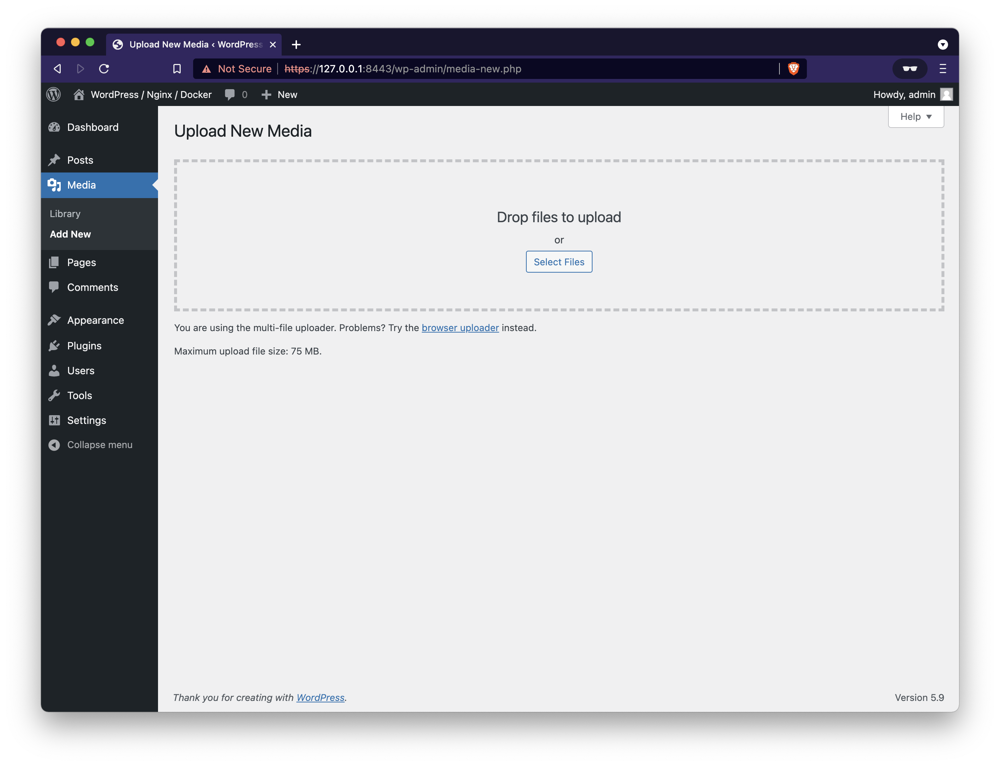
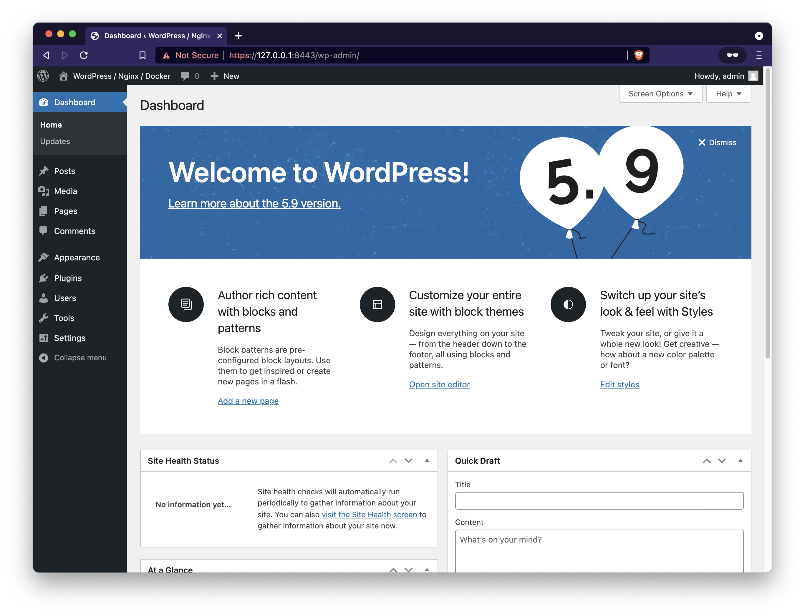
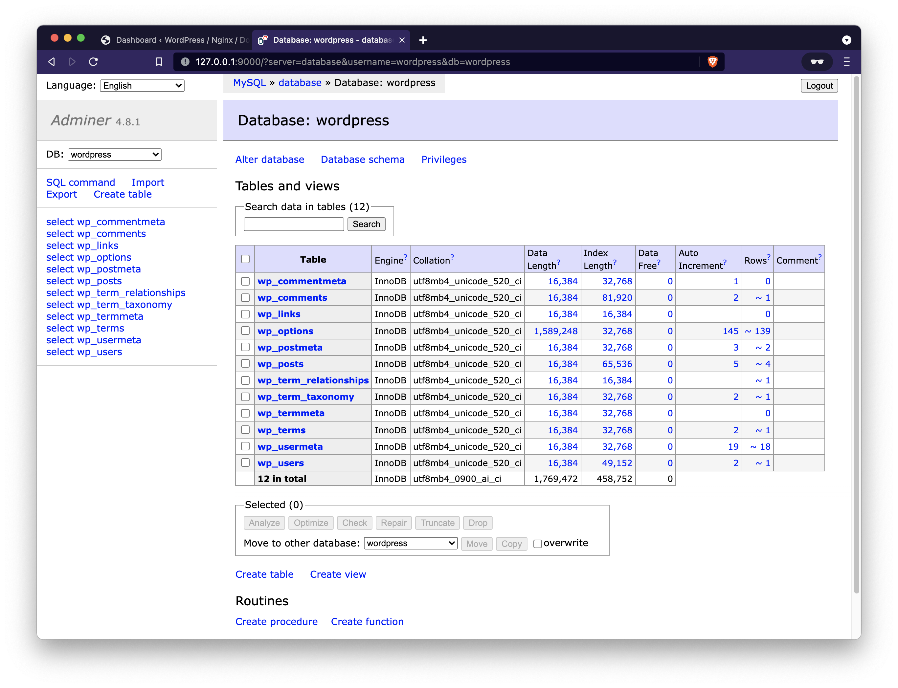

# WordPress (FPM Edition) - Docker

Notes on deploying a single site [WordPress FPM Edition](https://hub.docker.com/_/wordpress/) instance as a docker deployment orchestrated by Docker Compose.

- Use the FPM version of WordPress (v5-fpm)
- Use MySQL as the database (v8)
- Use Nginx as the web server (v1)
- Use Adminer as the database management tool (v4)
- Include self-signed SSL certificate ([Let's Encrypt localhost](https://letsencrypt.org/docs/certificates-for-localhost/) format)

**DISCLAIMER: The code herein may not be up to date nor compliant with the most recent package and/or security notices. The frequency at which this code is reviewed and updated is based solely on the lifecycle of the project for which it was written to support, and is not actively maintained outside of that scope. Use at your own risk.**

## Table of contents

- [Overview](#overview)
    - [Host requirements](#reqts)
- [Configuration](#config)
- [Deploy](#deploy)
- [Adminer](#adminer)
- [Teardown](#teardown)
- [References](#references)
- [Notes](#notes)

## <a name="overview"></a>Overview

WordPress is a free and open source blogging tool and a content management system (CMS) based on PHP and MySQL, which runs on a web hosting service. Features include a plugin architecture and a template system.

This variant contains PHP-FPM, which is a FastCGI implementation for PHP. 

- See the [PHP-FPM website](https://php-fpm.org/) for more information about PHP-FPM.
- In order to use this image variant, some kind of reverse proxy (such as NGINX, Apache, or other tool which speaks the FastCGI protocol) will be required.

### <a name="reqts"></a>Host requirements

Both Docker and Docker Compose are required on the host to run this code

- Install Docker Engine: [https://docs.docker.com/engine/install/](https://docs.docker.com/engine/install/)
- Install Docker Compose: [https://docs.docker.com/compose/install/](https://docs.docker.com/compose/install/)

## <a name="config"></a>Configuration

Copy the `env.template` file as `.env` and populate according to your environment

```ini
# docker-compose environment file
#
# When you set the same environment variable in multiple files,
# here’s the priority used by Compose to choose which value to use:
#
#  1. Compose file
#  2. Shell environment variables
#  3. Environment file
#  4. Dockerfile
#  5. Variable is not defined

# Wordpress Settings
export WORDPRESS_LOCAL_HOME=./wordpress
export WORDPRESS_UPLOADS_CONFIG=./config/uploads.ini
export WORDPRESS_DB_HOST=database:3306
export WORDPRESS_DB_NAME=wordpress
export WORDPRESS_DB_USER=wordpress
export WORDPRESS_DB_PASSWORD=password123!

# MySQL Settings
export MYSQL_LOCAL_HOME=./dbdata
export MYSQL_DATABASE=${WORDPRESS_DB_NAME}
export MYSQL_USER=${WORDPRESS_DB_USER}
export MYSQL_PASSWORD=${WORDPRESS_DB_PASSWORD}
export MYSQL_ROOT_PASSWORD=rootpassword123!

# Nginx Settings
export NGINX_CONF=./nginx/default.conf
export NGINX_SSL_CERTS=./ssl
export NGINX_LOGS=./logs/nginx

# User Settings
# TBD
```

Modify `nginx/default.conf` and replace `$host` and `8443` with your **Domain Name** and exposed **HTTPS Port** throughout the file

```conf
# default.conf
# redirect to HTTPS
server {
    listen 80;
    listen [::]:80;
    server_name $host;
    location / {
        # update port as needed for host mapped https
        rewrite ^ https://$host:8443$request_uri? permanent;
    }
}

server {
    listen 443 ssl http2;
    listen [::]:443 ssl http2;
    server_name $host;
    index index.php index.html index.htm;
    root /var/www/html;
    server_tokens off;
    client_max_body_size 75M;

    # update ssl files as required by your deployment
    ssl_certificate /etc/ssl/fullchain.pem;
    ssl_certificate_key /etc/ssl/privkey.pem;

    # logging
    access_log /var/log/nginx/wordpress.access.log;
    error_log /var/log/nginx/wordpress.error.log;

    # some security headers ( optional )
    add_header X-Frame-Options "SAMEORIGIN" always;
    add_header X-XSS-Protection "1; mode=block" always;
    add_header X-Content-Type-Options "nosniff" always;
    add_header Referrer-Policy "no-referrer-when-downgrade" always;
    add_header Content-Security-Policy "default-src * data: 'unsafe-eval' 'unsafe-inline'" always;

    location / {
        try_files $uri $uri/ /index.php$is_args$args;
    }

    location ~ \.php$ {
        try_files $uri = 404;
        fastcgi_split_path_info ^(.+\.php)(/.+)$;
        fastcgi_pass wordpress:9000;
        fastcgi_index index.php;
        include fastcgi_params;
        fastcgi_param SCRIPT_FILENAME $document_root$fastcgi_script_name;
        fastcgi_param PATH_INFO $fastcgi_path_info;
    }

    location ~ /\.ht {
        deny all;
    }

    location = /favicon.ico {
        log_not_found off; access_log off;
    }

    location = /favicon.svg {
        log_not_found off; access_log off;
    }

    location = /robots.txt {
        log_not_found off; access_log off; allow all;
    }

    location ~* \.(css|gif|ico|jpeg|jpg|js|png)$ {
        expires max;
        log_not_found off;
    }
}
```

Modify the `config/uploads.ini` file if the preset values are not to your liking (defaults shown below)

```ini
file_uploads = On
memory_limit = 256M
upload_max_filesize = 75M
post_max_size = 75M
max_execution_time = 600
```

Included `uploads.ini` file allows for **Maximum upload file size: 75 MB**



## <a name="deploy"></a>Deploy

Once configured the containers can be brought up using Docker Compose

1. Set the environment variables and pull the images

    ```console
    source .env
    docker-compose pull
    ```

2. Bring up the Database and allow it a moment to create the WordPress user and database tables

    ```console
    docker-compose up -d database
    ```
    
    You will know it's ready when you see something like this in the docker logs
    
    ```console
    $ docker-compose logs database
    wp-database  | 2022-01-28 13:40:18+00:00 [Note] [Entrypoint]: Entrypoint script for MySQL Server 8.0.28-1debian10 started.
    wp-database  | 2022-01-28 13:40:18+00:00 [Note] [Entrypoint]: Switching to dedicated user 'mysql'
    wp-database  | 2022-01-28 13:40:18+00:00 [Note] [Entrypoint]: Entrypoint script for MySQL Server 8.0.28-1debian10 started.
    wp-database  | 2022-01-28 13:40:18+00:00 [Note] [Entrypoint]: Initializing database files
    ...
    wp-database  | 2022-01-28 13:40:28+00:00 [Note] [Entrypoint]: Creating database wordpress
    wp-database  | 2022-01-28 13:40:28+00:00 [Note] [Entrypoint]: Creating user wordpress
    wp-database  | 2022-01-28 13:40:28+00:00 [Note] [Entrypoint]: Giving user wordpress access to schema wordpress
    wp-database  |
    wp-database  | 2022-01-28 13:40:28+00:00 [Note] [Entrypoint]: Stopping temporary server
    wp-database  | 2022-01-28T13:40:29.002886Z 13 [System] [MY-013172] [Server] Received SHUTDOWN from user root. Shutting down mysqld (Version: 8.0.28).
    wp-database  | 2022-01-28T13:40:30.226306Z 0 [System] [MY-010910] [Server] /usr/sbin/mysqld: Shutdown complete (mysqld 8.0.28)  MySQL Community Server - GPL.
    wp-database  | 2022-01-28 13:40:31+00:00 [Note] [Entrypoint]: Temporary server stopped
    wp-database  |
    wp-database  | 2022-01-28 13:40:31+00:00 [Note] [Entrypoint]: MySQL init process done. Ready for start up.
    wp-database  |
    ...
    wp-database  | 2022-01-28T13:40:32.061642Z 0 [System] [MY-011323] [Server] X Plugin ready for connections. Bind-address: '::' port: 33060, socket: /var/run/mysqld/mysqlx.sock
    wp-database  | 2022-01-28T13:40:32.061790Z 0 [System] [MY-010931] [Server] /usr/sbin/mysqld: ready for connections. Version: '8.0.28'  socket: '/var/run/mysqld/mysqld.sock'  port: 3306  MySQL Community Server - GPL.
    ```

3. Bring up the WordPress and Nginx containers

    ```console
    docker-compose up -d wordpress nginx
    ```
    
    After a few moments the containers should be observed as running
    
    ```console
    $ docker-compose ps
    NAME                COMMAND                  SERVICE             STATUS              PORTS
    wp-database         "docker-entrypoint.s…"   database            running             33060/tcp
    wp-nginx            "/docker-entrypoint.…"   nginx               running             0.0.0.0:8080->80/tcp, 0.0.0.0:8443->443/tcp
    wp-wordpress        "docker-entrypoint.s…"   wordpress           running             9000/tcp
    ```

The WordPress application can be reached at the designated host and port (e.g. [https://127.0.0.1:8443]()).

- **NOTE**: you will likely have to acknowledge the security risk if using the included self-signed certificate.

 

Complete the initial WordPress installation process, and when completed you should see something similar to this.




## <a name="adminer"></a>Adminer

An Adminer configuration has been included in the `docker-compose.yml` definition file, but commented out. Since it bypasses Nginx it is recommended to only use Adminer as needed, and to not let it run continuously.

Expose Adminer by uncommenting the `adminer` section of the `docker-compose.yml` file

```yaml
...
  # adminer - bring up only as needed - bypasses nginx
  adminer:
    # default port 8080
    image: adminer:4
    container_name: wp-adminer
    restart: unless-stopped
    networks:
      - wordpress
    depends_on:
      - database
    ports:
      - "9000:8080"
...
```

And run the `adminer` container

```console
$ docker-compose up -d adminer
[+] Running 2/2
 ⠿ Container wp-database  Running                                                                                                      0.0s
 ⠿ Container wp-adminer   Started                                                                                                      0.9s
```

Since Adminer is bypassing our Nginx configuration it will be running over HTTP in plain text on port 9000 (e.g. [http://127.0.0.1:9000/]())


Enter the connection information for your Database and you should see something similar to image below.

Example connection information:

- System: **MySQL**
- Server: **database**
- Username: **wordpress**
- Password: **password123!**
- Database: **wordpress**

    **NOTE**: Since `adminer` is defined in the same docker-compose file as the MySQL Database it will "understand" the **Server** reference as **database**, otherwise this would need to be a formal URL reference



When finished, stop and remove the `adminer` container.

```console
$ docker-compose stop adminer
[+] Running 1/1
 ⠿ Container wp-adminer  Stopped                                                                                                       0.1s
$ docker-compose rm -fv adminer
Going to remove wp-adminer
[+] Running 1/0
 ⠿ Container wp-adminer  Removed                                                                                                       0.0s
```

## <a name="teardown"></a>Teardown

For a complete teardown all containers must be stopped and removed along with the volumes and network that were created for the application containers

Commands

```console
docker-compose stop
docker-compose rm -fv
docker-network rm wp-wordpress
# removal calls may require sudo rights depending on file permissions
rm -rf ./wordpress
rm -rf ./dbdata
rm -rf ./logs
```

Expected output

```console
$ docker-compose stop
[+] Running 3/3
 ⠿ Container wp-nginx      Stopped                                                                                                     0.3s
 ⠿ Container wp-wordpress  Stopped                                                                                                     0.2s
 ⠿ Container wp-database   Stopped                                                                                                     0.8s
$ docker-compose rm -fv
Going to remove wp-nginx, wp-wordpress, wp-database
[+] Running 3/0
 ⠿ Container wp-nginx      Removed                                                                                                     0.0s
 ⠿ Container wp-database   Removed                                                                                                     0.0s
 ⠿ Container wp-wordpress  Removed                                                                                                     0.0s
$ docker network rm wp-wordpress
wp-wordpress
$ rm -rf ./wordpress
$ rm -rf ./dbdata
$ rm -rf ./logs
```

## <a name="references"></a>References

- WordPress Docker images: [https://hub.docker.com/_/wordpress/](https://hub.docker.com/_/wordpress/)
- MySQL Docker images: [https://hub.docker.com/_/mysql](https://hub.docker.com/_/mysql)
- Nginx Docker images: [https://hub.docker.com/_/nginx/](https://hub.docker.com/_/nginx/)
- Adminer Docker images: [https://hub.docker.com/_/adminer](https://hub.docker.com/_/adminer)

---

## <a name="notes"></a>Notes

General information regarding standard Docker deployment of WordPress for reference purposes

### Let's Encrypt SSL Certificate

Use: [https://github.com/RENCI-NRIG/ez-letsencrypt](https://github.com/RENCI-NRIG/ez-letsencrypt) - A shell script to obtain and renew [Let's Encrypt](https://letsencrypt.org/) certificates using Certbot's `--webroot` method of [certificate issuance](https://certbot.eff.org/docs/using.html#webroot).

### Error establishing database connection

This can happen when the `wordpress` container attempts to reach the `database` container prior to it being ready for a connection.


This will sometimes resolve itself once the database fully spins up, but generally it's advised to start the database first and ensure it's created all of its user and wordpress tables and then start the WordPress service.

### Port Mapping

Neither the **wordpress** container nor the **database** container have publicly exposed ports. They are running on the host using a docker defined network which provides the containers with access to each others ports, but not from the host.

If you wish to expose the ports to the host, you'd need to alter the stanzas for each in the `docker-compose.yml` file.

For the `database` stanza, add

```
    ports:
      - "3306:3306"
```

For the `wordpress` stanza, add

```
    ports:
      - "9000:9000"
```
